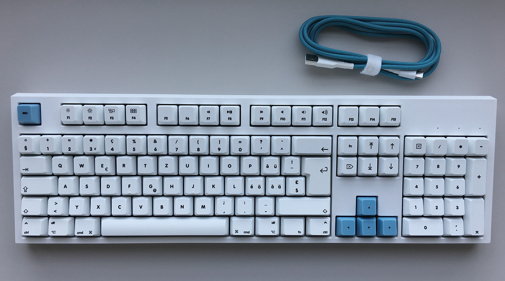
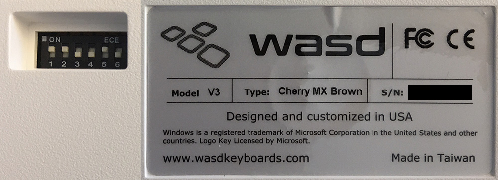
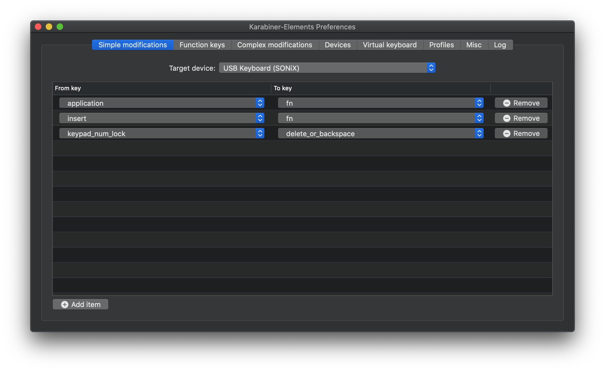
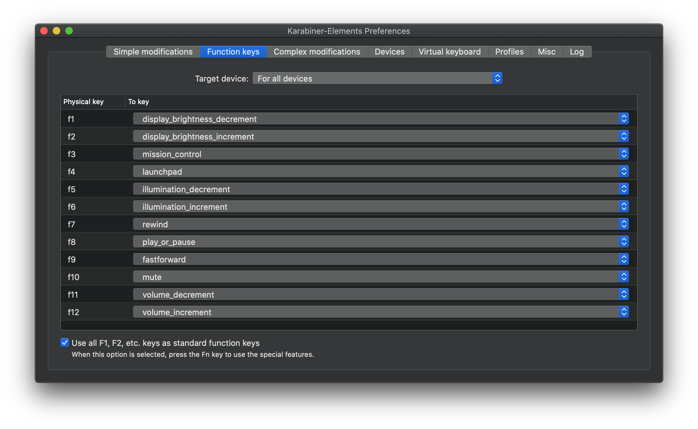

Mechanische Tastatur mit Schweizerdeutscher Belegung für Macs
=============================================================

Im folgenden wird beschrieben, wie man eine Tastatur von [WASD Keyboards]
mit einer schweizerdeutsche Belegung für Macs konfigurieren kann.

Um die Tastaturen von [WASD Keyboards] vollständig auf dem Mac nutzbar zu machen
sind folgende drei Schritte notwendig:

1. **Druckvorlage (SVG-Layout)** mit Tasten für schweizerdeutschen Umlaute und
   Mac-spezifischen Symbole
2. **Konfiguration (DIP-Switches)** der WASD-Tastatur in den Mac-Kompatibilitätsmodus
3. **Spezialtasten (Keyboard-Mapping)** wie beispielsweise Helligkeit und Lautstärke
   unter Mac nutzbar machen

Schritt 1: Druckvorlage
-----------------------

Als Vorlage das Modell "WASD V3 105-Key ISO Custom Mechanical Keyboard"
auf [WASD Keyboards] wählen. Zur Erklärung:
* ISO: bedeutet, das eine grosse Enter-Taste verwendet wird, wie diese bei
  schweizerdeutschen Tastaturen herkömmlich ist 
* 105-Key: ist die Standardgrössse von Tastaturen mit Ziffernblock und separaten
  Pfeiltasten. Das hier vorliegende SVG-Layout wurde für diese grösse erstellt

Als Druckvorlage kann diese Datei verwendet werden: [wasd-inkscape-105-8.16.2019-chde-mac-print.svg](wasd-inkscape-105-8.16.2019-chde-mac-print.svg)

Es handelt sich bei dieser Datei um eine bereinigte und minifizierte Exportdatei, in der alle
Schriften in Pfade umgewandelt wurden, wie dies von WASD verlangt wird. Die Quelldatei
befindet sich im Unterordner [sources](sources/).

Schritt 2: Konfiguration
------------------------

Die WASD-Tastatur lässt sich in einen Mac-Kompatibilitätsmodus versetzen. Welche
DIP-Switches auf der Unterseite der Tastatur umgestellt werden müssen, hängt von der
Tastaturrevision ab. Für die hier vorliegende Tastatur gilt die [V3 v0.14 User Guide]
mit folgenden Einstellungen:

| Switch State          | Function        |
| :-------------------: | --------------- |
| SW 1 On SW 2 On  | Mac Mode        |
| SW 5 On               | Fn Key Disabled |

Zur Erklärung:
* Der "Mac Mode" vertauscht die Positionen von CMD und ALT
* Die Multimedia-Taste ("Fn Key") muss deaktiviert werden, damit diese später als
  Funktionstaste in Karabiner (Schritt 3) konfiguriert werden kann

Schritt 3: Spezialtasten
------------------------

Wie bereits erwähnt, wird die WASD-Tastatur als PC-Tastatur am Mac erkannt. Der konfigurierte
"Mac Modus" hilft nur bedingt.

Mit der Software [Karabiner-Elements] lassen sich nun die Funktionstasten (Helligkeit,
Lautstärke etc.) auf dem Mac nutzbar machen. Dazu sind folgende Einstellungen notwendig:

Leider lässt sich in Karabiner die Programm-Konfiguration nicht von der individuellen
Tastaturkonfiguration trennen. Hier ist die von mir verwendete Gesamtkonfiguration für
Karabiner, welche nach `~/.config/karabiner/karabiner.json` kopiert werden muss.

Meine Karabiner Konfiguration: [karabiner.json](https://raw.githubusercontent.com/dlorch/mechanical-keyboard-swiss-layout-mac/master/karabiner.json)

Viel Spass mit der Tastatur!

---

Daniel Lorch, im Oktober 2019

[WASD Keyboards]: http://www.wasdkeyboards.com
[V3 v0.14 User Guide]: https://support.wasdkeyboards.com/hc/article_attachments/360038937633/V3_user_manual_FW_0.14.pdf
[Karabiner-Elements]: https://pqrs.org/osx/karabiner/
